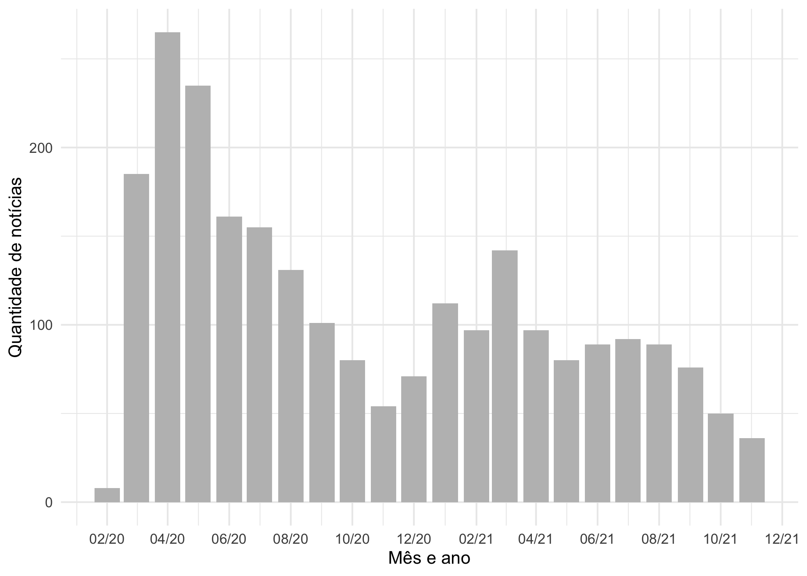

<!-- README.md is generated from README.Rmd. Please edit that file -->

# noticiasgov

<!-- badges: start -->

[](https://github.com/beatrizmilz/noticiasgov/actions/workflows/atualizar_dados.yaml)

<!-- badges: end -->

O objetivo deste repositório/pacote é raspar as notícias de portais de
noticias governamentais, e disponibilizar em `.csv`.

| Bases                                                                                                | Código para importar no R                                                                 |
|:-----------------------------------------------------------------------------------------------------|:------------------------------------------------------------------------------------------|
| [SP](https://raw.githubusercontent.com/beatrizmilz/noticiasgov/master/inst/base_noticias_gov_sp.csv) | `base_noticias_gov_sp <- readr::read_delim("inst/base_noticias_gov_sp.csv", delim = ";")` |

## Exemplo dos dados disponíveis

``` r
base_noticias_gov_sp <- readr::read_delim("inst/base_noticias_gov_sp.csv", delim = ";")

dplyr::glimpse(base_noticias_gov_sp)
#> Rows: 92,937
#> Columns: 11
#> $ id              <dbl> 5456032, 5455976, 5455942, 5455903, 5455893, 5455889, …
#> $ data            <date> 2021-11-24, 2021-11-24, 2021-11-24, 2021-11-24, 2021-…
#> $ horario         <chr> "19h35", "18h03", "16h20", "14h01", "13h39", "13h31", …
#> $ url_noticia     <chr> "https://www.saopaulo.sp.gov.br/ultimas-noticias/sp-re…
#> $ titulo          <chr> "SP registra 4,43 milhões de casos e 153,6 mil óbitos …
#> $ chamada         <chr> "Mais de 4,25 milhões já se recuperaram no decorrer da…
#> $ categorias      <chr> "noticias coronavirus, saude, secretaria da saude, spn…
#> $ tags            <chr> NA, NA, NA, NA, NA, NA, NA, "atendimento ao cidadao, c…
#> $ img_url         <chr> "https://www.saopaulo.sp.gov.br/wp-content/uploads/202…
#> $ img_alt         <chr> "SP registra 4,43 milhões de casos e 153,6 mil óbitos …
#> $ url_noticia_img <chr> "https://www.saopaulo.sp.gov.br/ultimas-noticias/sp-re…
```

Pesquisar a quantidade de notícias que contém algum termo ao longo do
tempo:

``` r
library(ggplot2)

noticias_sp_filtradas <- base_noticias_gov_sp %>%
  dplyr::mutate(titulo_clean = stringr::str_to_lower(titulo),
                titulo_clean = abjutils::rm_accent(titulo_clean)) %>% 
  dplyr::filter(
    stringr::str_detect(categorias, "coronavirus") |
      stringr::str_detect(titulo_clean, "covid-19|coronavirus|covid 19")
  )


noticias_sp_filtradas %>%
  dplyr::mutate(mes = lubridate::floor_date(data, unit = "month")) %>%
  dplyr::count(mes) %>%
  ggplot() +
  geom_col(aes(x = mes, y = n), fill = "gray") +
  scale_x_date(date_labels = "%m/%y", date_breaks = "2 months") +
  labs(y = "Quantidade de notícias", x = "Mês/ano", title = "Número de notícias por mês",
       subtitle = "Notícias publicadas na categoria 'coronavirus', \nou que tem no título alguma das seguintes palavras:  \nCoronavírus, COVID-19, Covid 19") +
  theme_minimal()
```


